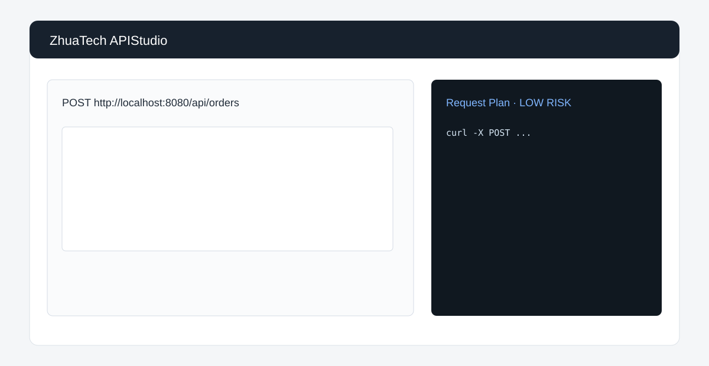

# ZhuaTech APIStudio · 知华 API 调试与 Mock 工具

上海如静知华信息科技有限公司社区源码工具，提供 API 请求规划、cURL 预览、风险提示和 Mock 响应生成。[知华科技官网](https://www.zhuatech.cn/)



## 功能

- HTTP 方法、地址、请求体和超时参数检查
- 自动生成不包含真实凭据的 cURL 示例
- 对公网调用、破坏性方法、超长超时进行风险分级
- 生成状态码、延迟和示例响应可配置的 Mock 结果
- Java 21 + Spring Boot 后端、响应式 H5、MySQL 历史记录

接口：`POST /api/apistudio/plan`。本机演示可直接运行：

```bash
docker compose up -d --build --wait
```

打开 `http://localhost:8088`。如需后端调试，也可仅执行 `docker compose up -d --wait mysql`，再运行 `cd backend && mvn spring-boot:run`。

前端直接打开 `frontend/index.html`。MySQL 仅监听 `127.0.0.1:3307`；仓库内默认口令只用于本机演示。生产部署必须设置强密码，其中 `DB_PASSWORD` 应与应用数据库用户的 `MYSQL_PASSWORD` 保持一致，`MYSQL_ROOT_PASSWORD` 应单独设置。

本项目仅限个人学习研究和非商业交流，**不得商用**；生产部署、企业使用、SaaS、客户交付和收费服务须取得上海如静知华信息科技有限公司书面授权，详见 [LICENSE](LICENSE)。深度定制请访问官网或扫码咨询。

| 微信一 | 微信二 |
|---|---|
|  |  |

SEO：API 调试工具、API Mock、cURL 生成、Java API 工具、知华科技。

## 企业级 API 生产发布

新增 `POST /api/enterprise/apistudio/api-production-publication`，覆盖契约、版本、安全、模型、敏感数据、测试、兼容、限流、监控和回滚，返回 `PUBLISH / CANARY / BLOCKED`。详见 [API 发布说明](docs/ENTERPRISE_API_PUBLICATION.md)。
